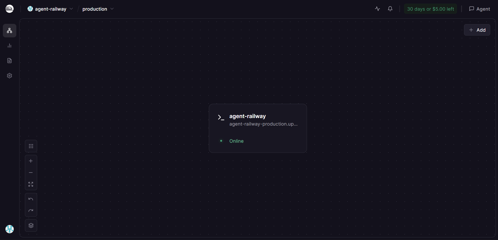
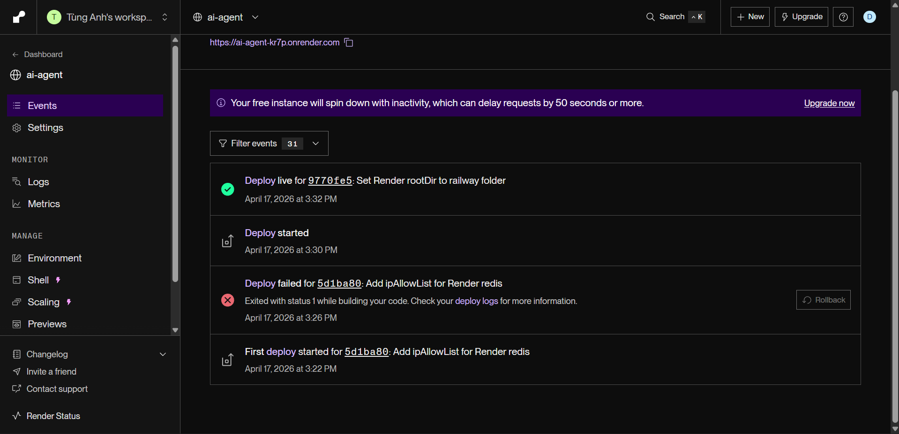

# Day 12 Lab - Trả lời nhiệm vụ

## Part 1: Localhost vs Production

### Exercise 1.1: Các anti-pattern tìm thấy
1. Hardcode thông tin bí mật trong code (`OPENAI_API_KEY`, `DATABASE_URL`) dễ bị lộ khi push lên Git.
2. Không có quản lý cấu hình: `DEBUG`, `MAX_TOKENS` bị đóng đinh trong code.
3. Dùng `print()` để log và còn log cả secret ra console.
4. Không có endpoint health check để platform theo dõi và tự restart.
5. Cố định host/port (`localhost:8000`) và `reload=True`, không phù hợp deploy cloud/container.

### Exercise 1.3: Bảng so sánh
| Feature | Develop | Production | Vì sao quan trọng? |
|---------|---------|------------|--------------------|
| Config | Hardcode trong code | Biến môi trường (`.env`) | Bảo mật secret và dễ thay đổi cấu hình theo môi trường mà không sửa code. |
| Health check | Không có | `/health` và `/ready` | Giúp cloud phát hiện lỗi và chỉ route traffic khi app sẵn sàng. |
| Logging | `print()` | Logging JSON có cấu trúc | Dễ lọc/phân tích log và tránh lộ secret. |
| Shutdown | Đột ngột | Graceful shutdown | Hoàn thành request đang chạy và cleanup trước khi thoát. |

## Part 2: Docker

### Exercise 2.1: Dockerfile questions
1. Base image là nền tảng (OS + runtime) để container chạy ứng dụng.
2. `WORKDIR` là thư mục làm việc mặc định bên trong container.
3. Copy `requirements.txt` trước để tận dụng Docker layer cache, tránh phải cài lại dependencies khi code thay đổi.
4. `CMD` là lệnh mặc định có thể bị ghi đè; `ENTRYPOINT` là lệnh “cứng”, tham số sau `docker run` sẽ được thêm làm đối số.

### Exercise 2.2: Build & run (develop)
- Kết quả gọi API `/ask`: "Tôi là AI agent được deploy lên cloud. Câu hỏi của bạn đã được nhận."
- Kích thước image (docker images): Disk Usage ~ 1.66 GB, Content Size ~ 424 MB.

### Exercise 2.3: Multi-stage build
1. Stage 1 (builder) dùng `python:3.11-slim`, cài build tools (`gcc`, `libpq-dev`) và cài dependencies vào `/root/.local` bằng `pip install --user`.
2. Stage 2 (runtime) tạo `appuser`, copy packages từ builder sang `/home/appuser/.local`, copy source + utils, thiết lập `PATH`, `HEALTHCHECK` và chạy `uvicorn`.
3. Image nhỏ hơn vì bỏ lại build tools/cache ở stage 1 và chỉ giữ runtime + source ở stage 2.
	- Develop: Disk Usage ~ 1.66 GB, Content Size ~ 424 MB.
	- Production: Disk Usage ~ 236 MB, Content Size ~ 56.6 MB.
   - Difference: ~86.6% smaller (theo Content Size).

### Exercise 2.4: Docker Compose stack
1. Các service và nhiệm vụ:
	- `agent`: AI agent FastAPI, xử lý logic chính và gọi các dịch vụ phụ trợ.
	- `redis`: cache cho session và rate limiting.
	- `qdrant`: vector database phục vụ RAG.
	- `nginx`: reverse proxy/load balancer, nhận request từ bên ngoài.
2. Luồng giao tiếp:
	- Client -> `nginx` (cổng 80/443).
	- `nginx` proxy vào `agent` trong mạng nội bộ.
	- `agent` dùng `redis` (session/rate limit) và `qdrant` (vector search).
	- Kết quả trả ngược về `nginx` rồi trả cho client.
3. Architecture diagram (ASCII):

```
Internet
   |
   v
+---------+         internal network: internal
| Client  |---------------------------------------------+
+---------+                                             |
   |                                                   |
   v                                                   |
+---------+     :80/:443                               |
|  Nginx  |-------------------------------------------+ |
+---------+                                           | |
   |                                                   | |
   v                                                   | |
+---------+     :8000                                  | |
|  Agent  |--------------------------------------+      | |
| FastAPI |                                      |      | |
+---------+                                      |      | |
   |   |                                         |      | |
   |   +--------------+                          |      | |
   |                  |                          |      | |
   v                  v                          |      | |
+-------+         +--------+                     |      | |
| Redis |         | Qdrant |                     |      | |
| cache |         | vector |                     |      | |
+-------+         +--------+                     |      | |
   |                  |                          |      | |
   v                  v                          |      | |
redis_data       qdrant_data                     |      | |
  (volume)         (volume)                      |      | |
                                                     | |
Note: Agent khong expose port ra ngoai, chi Nginx nhan request tu internet.
```

## Part 3: Cloud Deployment

### Exercise 3.1: Railway deployment
- URL: https://agent-railway-production.up.railway.app
- Health check: `ok` (GET /health)
- Ask endpoint: "Đây là câu trả lời từ AI agent (mock). Trong production, đây sẽ là response từ OpenAI/Anthro…" (POST /ask).
- Screenshot: 

### Exercise 3.2: Render deployment
- URL: https://ai-agent-kr7p.onrender.com
- Ask endpoint: "Tôi là AI agent được deploy lên cloud. Câu hỏi của bạn đã được nhận." (POST /ask).
- Screenshot: 

So sánh render.yaml và railway.toml:
- render.yaml (Render): khai báo infrastructure theo kiểu blueprint (services, redis add-on, env vars, autoDeploy), định nghĩa cả web service và redis trong một file.
- railway.toml (Railway): tập trung vào build/deploy cho một service (startCommand, healthcheck), env vars set qua dashboard/CLI.
- Render bắt buộc blueprintPath và rootDir cho repo monorepo; Railway chỉ cần service và auto-detect build.
- Render cho phép khai báo thêm add-on (redis) trong file; Railway thường tạo service/add-on riêng.

## Part 4: API Security

### Exercise 4.1: API Key authentication
- API key được check trong hàm `verify_api_key` ở `app.py`, dùng header `X-API-Key`.
- Thiếu key: trả 401 với thông báo "Missing API key. Include header: X-API-Key: <your-key>".
- Sai key: trả 403 "Invalid API key.".
- Rotate key: đổi biến môi trường `AGENT_API_KEY` và restart app.
- Test:
   - Có key: trả về answer cho câu hỏi "Hello".
   - Không có key: trả về lỗi 401 như trên.

### Exercise 4.2: JWT authentication
- Lấy token từ `/auth/token` với user `student`/`demo123`.
- Gọi `/ask` với header `Authorization: Bearer <token>`.
- Kết quả mẫu: "Container là cách đóng gói app để chạy ở mọi nơi. Build once, run anywhere!"

### Exercise 4.3: Rate limiting
- Algorithm: Sliding Window Counter (đếm request trong cửa sổ 60 giây).
- Limit: user 10 req/phút, admin 100 req/phút.
- Bypass admin: role `admin` dùng `rate_limiter_admin` (giới hạn cao hơn).
- Test: 10 request đầu trả 200 OK; từ request 11 trở đi trả 429 với "Rate limit exceeded" và `retry_after_seconds` giảm dần (ví dụ 39s, 37s, 35s...).

### Exercise 4.4: Cost guard
- Cost guard được kiểm tra trong `app.py` trước khi gọi LLM qua `cost_guard.check_budget(username)`.
- Giới hạn: per-user $1/ngày, global $10/ngày (theo `CostGuard`).
- Vượt budget: per-user trả 402 với "Daily budget exceeded"; nếu vượt global budget trả 503 "Service temporarily unavailable due to budget limits".

## Part 5: Scaling & Reliability

### Exercise 5.1: Health checks
- `/health`: trả `status: ok`, có `uptime_seconds`, `version`, `environment`.
- `/ready`: trả `ready: True` và `in_flight_requests`.

### Exercise 5.2: Graceful shutdown
- Log nhận SIGINT/SIGTERM: "Graceful shutdown initiated..." và "Shutdown complete" trước khi process dừng.

### Exercise 5.3: Stateless design
- Trạng thái hội thoại không lưu trong memory, mà lưu Redis qua `save_session`, `load_session`, `append_to_history`.
- Mỗi instance đều đọc/ghi cùng session từ Redis, nên scale nhiều instance không bị mất state.
- Nếu không có Redis thì fallback in-memory (không scalable) — chỉ để demo.

### Exercise 5.4: Load balancing
- Chạy stack với 3 agent và Nginx.
- Gọi 10 request qua `http://localhost/ask` đều trả 200 OK.
- Log agent ghi nhận nhiều request POST /ask (ví dụ agent-1 xử lý các request trong log mẫu).

### Exercise 5.5: Test stateless
- `test_stateless.py` tạo session, gửi 5 request và được serve bởi nhiều instance khác nhau.
- Instances used: instance-658011, instance-80b882, instance-046ae8.
- History giữ đủ 10 messages, chứng minh session được lưu qua Redis và không phụ thuộc instance.

## Part 6: Final Project

### Local run & checks
- /health: status ok, version 1.0.0, environment staging.
- /ready: ready = True.
- /ask (API key): trả lời "Deployment là quá trình đưa code từ máy bạn lên server để người khác dùng được.".

### Production readiness
- check_production_ready.py: 20/20 checks passed (100%).

### Public URL (Railway)
- https://day12-final-agent-production.up.railway.app

### Public API test
- /ask với `X-API-Key: final-secret-key` trả về câu trả lời, model `gpt-4o-mini`.
